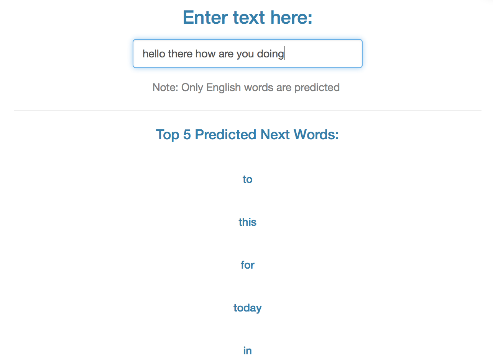

## Introduction
This is the final assessment of the Coursera Data Science Specialization's Capstone project which is provided by the Johns Hopkins University and in cooperation with SwiftKey.

### **The Objective**

 - The main goal of this capstone project is to build a text prediction model and deploy it as a Shiny application.
 - This application is able to predict the next word given the preceeding word(s) input by the user.
  


## Building the Model
This project (from data collection to pitch the app) is divided into 7 sub tasks:

1. Collect and process text samples from HC Corpora corpus.
2. Perform exploratory analysis on the sample corpus.
3. Build a basic N-gram backoff model.
4. Improve prediction model's performance.
5. Improve prediction model's accuracy.
6. Implement Shiny app for the model.
7. Prepare slide deck to "pitch" this data product.

## How to Use the App

Simply enter any text/sentence in the box and the top 5 predicted next words will be dislayed.  
```{r, out.width = "600px", echo = FALSE}

```


## Notes and Resources

1. The app is hosted on shinyapps.io: [https://zywong89.shinyapps.io/myTextPred/](https://zywong89.shinyapps.io/myTextPred/)
2. Notes on the app:

    - If there are no words entered, no words will be dislayed.
    - If the model does not recognize a word/phrase, only the most common 1-gram words will be displayed.
    - Whatever input given, the model will always return 5 predicted words.
3. The whole code for this project (for the 7 sub tasks) is available at Github repo: [https://github.com/zywong89/CapstoneProject.git](https://github.com/zywong89/CapstoneProject.git).

